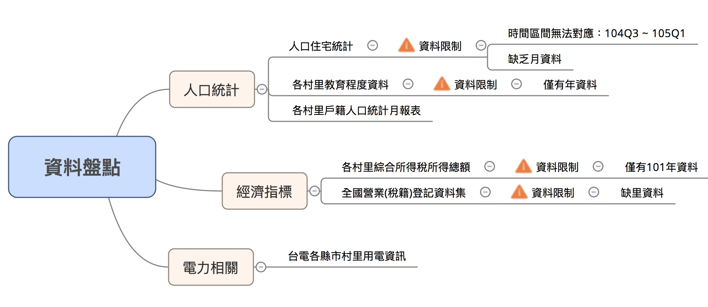

## About Me 

<div class="columns-2">


### Sheng Lin

- 政大統計所碩二  
    - 健保資料庫
    - SQL Server、R
- Whoscall Data Analyst Intern
    - User Profiling
    - Data Dashboard
    
</div>


# Agenda

## Agenda For DSP

- Open Data (10 mins)
  - + amd (-)
  - 用電量議題
- 資料收集與清理 Review (30 mins)
- Kmeans - 分群方法
- 進階圖表設計 (60 mins)
    - 空間資料分析
        - ggmap => 用電量地圖 (demo 20 ~ 30 min)
        - gg熱圖 => 遷移資料
    - 關連性分析：ggplotly => 用電量與面積的關係 
        - 泡泡圖等等...
    - 分群方法呈現：雷達圖 

# 研究主題：Power Analysis 

## Open Data in Taiwan (+)

英國「開放知識基金會」（Open Knowledge Foundation）的最新評比(20151209)，[2015年台灣在資料開放指數在全球149個評比國家中名列第一](http://www.ettoday.net/news/20151209/610454.htm)，領先日本、美國德國、法國等先進國家。

Open Data對台灣來說 = 金礦

而擅長於資料分析的我們，職責就是不斷挖掘金礦，創造Open Data的價值。

## Open Data in Taiwan (-)

雖然臺灣 Open Data 排名第一，但還是有許多可以改善的地方：

- 資料格式不統一
    - PDF, xls, csv
- 資料不完整
    - 時間、不易串檔

Open Data進行資料分析前，需要具備整理資料的能力 => 很好的訓練

## Power Analysis

<div class="columns-2">


台北創入夏以來最高溫37度 用電吃緊亮「限電警戒」紅燈，隨著溫度升高，用電需求也持續增加、供電吃緊。<br><br>
<h3>節電？從何節起？<br><br></h3>
<h3>用電量與人口特質的關係？</h3>

</div>

## Power Analysis (2)

<div class="columns-2">


### 你是否曾經思考過:

<h3>節電？從何節起？<br><br></h3>
- 臺灣的用電大戶地區有哪些呢？
<h3>用電量與人口特質的關係？</h3>
- 用電量高低的背後，是否跟某些因素有關呢？

</div>

## Power Analysis (3)

<h2>過去相關研究：</h2>

- [北市電力分析](http://rpubs.com/unityculture/183415)
- [台灣鄉鎮市區用電情況](http://www.thenewslens.com/article/21324)

# 手把手 Open Data 資料分析 

## 逃不過清資料的魔掌啦！

- 清理資料花費將近 **八成** 的時間
- 練功練coding練頭腦~~練脾氣~~最好的方式
- 幸運如你，我們已經將[資料打包]()好啦！
- Homework
    - 請同學參考[資料收集與整理 (3)](#data3)，將資料進行整理

## 資料收集與整理 (1)

<div align="center">



</div>

## 資料收集與整理 (2)

<div align="center">


</div>

## 資料收集與整理 (3) {.data3}

將以下不同來源的資料按照村里進行串檔(JOIN)：

- [台電電力資料](http://www.taipower.com.tw/content/announcement/ann01.aspx)
- [各村里綜合所得稅所得總額](http://data.gov.tw/node/17983)
- [各村里戶籍人口統計月報表](http://data.gov.tw/node/8411)
- [各村里教育程度資料](http://data.gov.tw/node/8409)

> Note 1: 因為資料的時間涵蓋範圍不同，本研究取2014年進行分析(除所得資料未涵蓋，其他皆有）。

> Note 2: 將2012年的各村里綜合所得稅總和資料作為2014年的推估，與其他資料進行串檔。

## 資料收集與整理 (4)

心得經驗：

- 1
- 2
- ..

## 同學！我們把資料打包好啦！

Data 放這～

回去記得自行練習整理！

# 進階圖表設計

# 空間資料分析

## 空間資料分析：ggmap

- 套件介紹、安裝
- 資料整理
- 圖表設計

# 雷達圖

## 雷達圖：highcharter

- 套件介紹、安裝
- 資料整理
- 圖表設計

## 套件安裝

```{r}
install.packages("highcharter")
```

## 資料整理

```{r, message=F}
library(ggplot2)
library(plotly)
library(DT)
library(data.table)
library(dplyr)
library(tidyr)
library(highcharter)
c("#A6CEE3","#1F78B4","#B2DF8A","#33A02C","#FB9A99","#E31A1C","#FDBF6F","#FF7F00","#CAB2D6","#6A3D9A") -> col.raw
cbind(grDevices::col2rgb(col.raw),3) -> col
data_cluster <- fread('./data/20160525_data_cluster.csv')
radar.data <- read.csv('./data/20160525_Radar_plot.csv') %>% 
  mutate_each(funs(round(.,digits=2)),-index)
data <- fread('iconv -f big5 -t utf8 ./data/20160426_data.csv')
```

## 資料整理(2)

```{r}
radar.data %>% 
  left_join(radar.data %>% 
              gather('cluster','value',-index) %>%
              group_by(index) %>% 
              summarise(mean = mean(value)) %>% 
              as.data.table(),
            by = 'index') %>% 
  mutate(index = factor(index,
                        levels = c('綜合所得中位數','平均教育程度','有偶比例',
                                   '女男比','扶老比','每戶平均用電度數'))) %>% 
  arrange(index)-> radar.data
```

## {.smaller}

```{r,eval=F}
highchart() %>% 
  hc_chart(polar = TRUE, type = "line") %>% 
  hc_title(text = "第1群 - 高所得已婚知識份子族群") %>% 
  hc_xAxis(categories = c('綜合所得中位數','平均教育程度','有偶比例',
                          '女男比','扶老比','每戶平均用電度數'),
           tickmarkPlacement = 'on',
           lineWidth = 0) %>% 
  hc_yAxis(gridLineInterpolation = 'polygon',
           lineWidth = 0,
           min = 0, max = 1) %>% 
  hc_series(
    list(
      name = "第1群 - 高所得已婚知識份子族群",
      data = radar.data[,c(2)],
      pointPlacement = 'on',color=col.raw[1]),
    list(
      name = "各群平均",
      data = radar.data[,c(12)],
      pointPlacement = 'on',color='#474747'))
```

## 畫圖！

```{r,echo=F}
highchart() %>% 
  hc_chart(polar = TRUE, type = "line") %>% 
  hc_title(text = "第1群 - 高所得已婚知識份子族群") %>% 
  hc_xAxis(categories = c('綜合所得中位數','平均教育程度','有偶比例',
                          '女男比','扶老比','每戶平均用電度數'),
           tickmarkPlacement = 'on',
           lineWidth = 0) %>% 
  hc_yAxis(gridLineInterpolation = 'polygon',
           lineWidth = 0,
           min = 0, max = 1) %>% 
  hc_series(
    list(
      name = "第1群 - 高所得已婚知識份子族群",
      data = radar.data[,c(2)],
      pointPlacement = 'on',color=col.raw[1]),
    list(
      name = "各群平均",
      data = radar.data[,c(12)],
      pointPlacement = 'on',color='#474747'))
```

# 互動式圖表：Plotly

## 互動式圖表：Plotly

- 套件介紹、安裝
- 資料整理
- 圖表設計

## 套件安裝

```{r,eval = F}
install.packages("plotly")
```


## 資料整理

```{r,echo=F}
data %>% 
  filter(統計年月 == c(10407)) %>% 
  select(-c(統計年月,縣市)) %>% 
  group_by(行政區域) %>% 
  summarise_each(funs(mean(.))) %>% 
  select(行政區域,每戶平均用電度數,
         女性比例, 男性比例,
         少年人口比例,青年人口比例,壯年人口比例,老年人口比例,總人數,有偶人數, ## 有偶比例
         綜合所得中位數, 大學以上比例, 大學比例, 大學以下比例) %>% 
  mutate(扶老比 = (1-青年人口比例-壯年人口比例-少年人口比例)/(青年人口比例+壯年人口比例),
         有偶比例 = 有偶人數/((1-少年人口比例)*總人數),
         平均教育程度 = 大學以上比例*6+大學比例*4+大學以下比例*0,
         女男比 = round(女性比例/男性比例,4)) %>% 
  select(行政區域,綜合所得中位數,平均教育程度,有偶比例,女男比,扶老比,每戶平均用電度數) %>%
  mutate_each(funs(scale(.)),-行政區域)  -> data.h

data %>% 
  filter(統計年月 == c(10407)) %>% 
  select(-c(統計年月,縣市)) %>% 
  group_by(行政區域) %>% 
  summarise_each(funs(mean(.))) %>% 
  select(行政區域,每戶平均用電度數,
         女性比例, 男性比例,
         少年人口比例,青年人口比例,壯年人口比例,老年人口比例,總人數,有偶人數, ## 有偶比例
         綜合所得中位數, 大學以上比例, 大學比例, 大學以下比例) %>% 
  mutate(扶老比 = (1-青年人口比例-壯年人口比例-少年人口比例)/(青年人口比例+壯年人口比例),
         有偶比例 = 有偶人數/((1-少年人口比例)*總人數),
         平均教育程度 = 大學以上比例*6+大學比例*4+大學以下比例*0,
         女男比 = round(女性比例/男性比例,4)) %>% 
  select(行政區域,綜合所得中位數,平均教育程度,有偶比例,女男比,扶老比,每戶平均用電度數) -> data.f

data.f %>% 
  left_join(
    data_cluster %>% 
      select(行政區域,cluster),
    by = '行政區域'
  ) %>% 
  as.data.frame() %>% datatable() %>% formatRound(2:44,digit=2)
```

## {.smaller}

```{r,eval=F}
cols <- c("1" = col.raw[1],"2" = col.raw[2],"3" = col.raw[3],"4" = col.raw[4],"5" = col.raw[5],
          "6" = col.raw[6],"7" = col.raw[7],"8" = col.raw[8],"9" = col.raw[9],"10" = col.raw[10])
data.f %>% 
  left_join(data_cluster %>% select(行政區域,cluster),
            by = '行政區域') %>% 
  ggplot(aes(x=綜合所得中位數,y=每戶平均用電度數,group=cluster,colour=cluster))+
  geom_point(alpha=0.5,aes(text = paste('地區:',行政區域 )))+
  stat_smooth(method = 'lm',formula = y ~ x,se=F,size=0.5,
              aes(text=paste('分群:',cluster)))+
  theme_bw(base_family = 'STHeiti')+
  theme(plot.title = element_text(size=rel(1.3)),
        axis.title.x = element_text(size = rel(2)),
        axis.title.y = element_text(size = rel(2))) +
  scale_colour_manual(values = cols) -> p1
ggplotly(p1)
```


## 畫圖！

```{r,echo=F}
cols <- c("1" = col.raw[1],"2" = col.raw[2],"3" = col.raw[3],"4" = col.raw[4],"5" = col.raw[5],
          "6" = col.raw[6],"7" = col.raw[7],"8" = col.raw[8],"9" = col.raw[9],"10" = col.raw[10])
data.f %>% 
  left_join(data_cluster %>% select(行政區域,cluster),
            by = '行政區域') %>% 
  ggplot(aes(x=綜合所得中位數,y=每戶平均用電度數,group=cluster,colour=cluster))+
  geom_point(alpha=0.5,aes(text = paste('地區:',行政區域 )))+
  stat_smooth(method = 'lm',formula = y ~ x,se=F,size=0.5,
              aes(text=paste('分群:',cluster)))+
  theme_bw(base_family = 'STHeiti')+
  theme(plot.title = element_text(size=rel(1.3)),
        axis.title.x = element_text(size = rel(2)),
        axis.title.y = element_text(size = rel(2))) +
  scale_colour_manual(values = cols) -> p1
ggplotly(p1)
```


<>